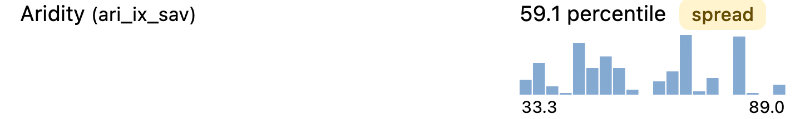
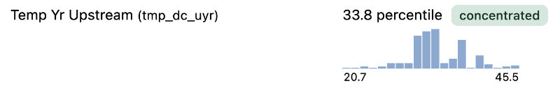
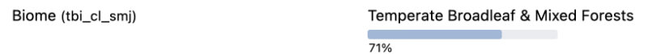
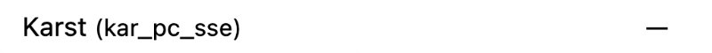
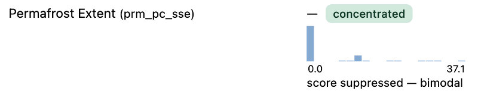
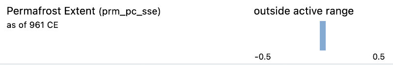
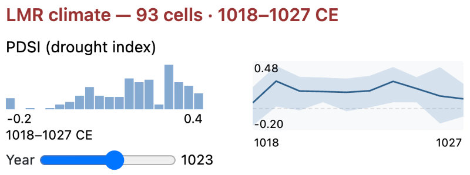
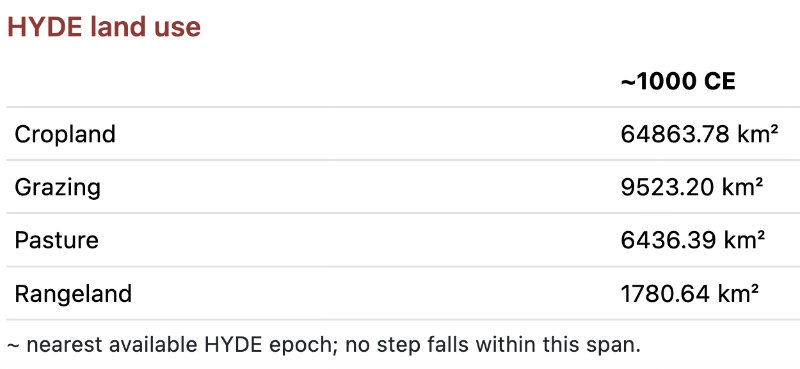
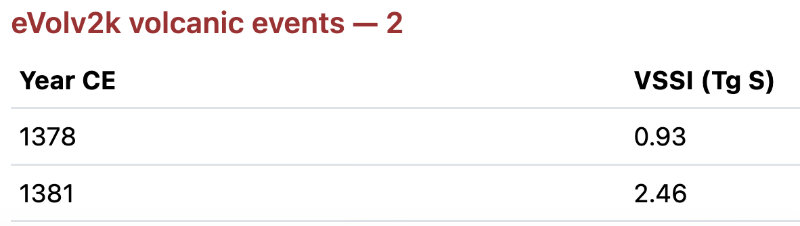

# Reading a signature

The Signature tab presents a place's environmental variables in accordions, one per band. This page
explains how to read what's displayed — the numbers, badges, bars, and small charts. It does not
explain how to operate the Sandbox (see [Overview](overview.md)) or what individual variables mean
(see the [Codebook](../codebook.md)).

## One basin or many

The single thing that determines how a signature looks is **how many basins the query covers**.

If you ask about a settlement without a buffer, the answer comes from one basin. Every variable has
exactly one value, and the display shows that value and where it sits globally.

If you add a buffer, or ask about a polity, the answer comes from a set of basins — sometimes a
handful, sometimes hundreds. There is no single value any more. What EDOPS shows instead is a
summary of the distribution across those basins, plus a chart of the distribution itself.

This is a consequence of the scope you choose, not of what kind of place you asked
about. A settlement with a wide buffer produces the same kind of display as a small polity.

## Numeric variables

### One basin

You get the measured value, its global percentile, and a marker showing that percentile on a line:

> Precip Yr — `762 mm/yr · 63.6 percentile`

The percentile is global. Each basin's raw value is ranked against every other basin worldwide at
the resolution level you queried — not against the region, not against the scope. A reading
of 63.6 means this basin is wetter than 63.6% of all basins on Earth.

### Many basins

You get an area-weighted percentile, a **concentrated** or **spread** badge, and a histogram of how
the constituent basins are distributed:

> Aridity — `59.1 percentile` · *spread*

> Temp Yr Upstream — `33.8 percentile` · *concentrated*

The headline percentile is the area-weighted mean of each contributing basin's own percentile —
larger basins pull it further. The two numbers flanking the histogram are the 10th and 90th
percentiles of that distribution: the middle-80% range, expressed in percentile points rather than
in the variable's own units.

The badge summarises how much the basins disagree. Under 20 percentile points between p10 and p90
is **concentrated** — the area is environmentally consistent in this respect. Twenty or more is
**spread** — the area contains real internal variation, and the headline number is an average over
genuinely different places.

Both badges are informative. *Spread* is not a warning; for a large polity it is often the expected
and interesting result.

### Reading the histogram

The shape tells you how many basins are in the query. A handful of tall isolated bars means a small
set — a buffered settlement, or a compact polity. A smooth mound means a large one. In a small set,
individual bars are individual basins and you can see the clustering directly; in a large set the
distribution's shape is what matters.

Note that a wide *range* and a *spread* badge are not the same thing. The range endpoints tell you
where the extremes fall; the badge tells you whether the bulk of the area agrees.

## Categorical variables

Categorical variables — biome, lithology, land cover, wetland class — have no percentile. They show
the most common class across the query area and the share of the area holding that class:

> Biome — `Temperate Broadleaf & Mixed Forests` · 71%

For a single basin this is always 100%: one basin has one majority class. For a set, the percentage
is what matters. A share of 97% means the area is essentially uniform. A share of 44% means the
named class is merely the largest of several, and more than half the area is something else — the
label alone would be misleading, and the bar is what stops you being misled.

Only the leading class is shown, not the full mixture.

## Extremes and single-basin selections

A few variables are not averaged at all. Where a variable represents a maximum or a defining
feature, the display reports the value from the single basin carrying it, along with that basin's
identifier, and no chart. These read as one value even for a large query, because they describe one
basin's contribution rather than a summary of all of them.

## When a value is missing

An em-dash (`—`) means no value is being reported. It does not mean zero. Zero is a real
measurement and displays as `0`.

For a single-basin query this usually means the variable isn't coded for that basin — as with karst,
permafrost, or the wetland groups in areas where those datasets have no coverage.

> Karst (no value)

In a multi-basin query, an empty headline can mean three different things, and the label tells you
which:

- **A bare dash with an empty histogram** means no basin in the query area had the variable at all —
  the same no-coverage case as above, just spread across a set of basins instead of one.
- **"score suppressed — bimodal,"** with the histogram still shown, means the contributing basins
  split into two genuinely different clusters rather than one continuous distribution. A single
  percentile would average across that split and misrepresent both halves, so none is reported — read
  the histogram directly instead.

    

- **"outside active range,"** with the histogram still shown, means the variable is present but
  essentially absent everywhere in the query area — for example, permafrost extent for a region with
  almost no permafrost. This is not missing data; the underlying values are genuinely at or near zero
  across nearly the whole area, and a percentile isn't a meaningful way to represent that.

    

## The date stamp

Where a query has a temporal component, each variable label carries a small `as of NNNN CE` note.
This records the year the query resolved to. For variables in the persistence bands the value itself
is contemporary — the stamp tells you the period the query was about, not the period the measurement
comes from. How far a contemporary measurement can be carried back is what the bands encode; see
[Premises and commitments](../design/commitments.md).

## Band T is different

Band T does not use any of the above. Its variables come from datasets that are genuinely indexed to
time, and each source has its own display:

- **LMR** — annual series charts for temperature, precipitation, and drought index, with a year
  slider and a small distribution summary. The header reports how many LMR grid cells intersect the
  query area and the year range covered.

    

- **HYDE** — a table of land-use extents at the selected year.

    

- **eVolv2k** — a list of volcanic events in the period with their sulfur injection values.

    

None of these carry percentiles, badges, or global rankings. They are values in time, not positions
in a global distribution, and they are read accordingly.

The count in the Band T accordion header counts values, not variables — it will be much larger than
the counts on the other bands.