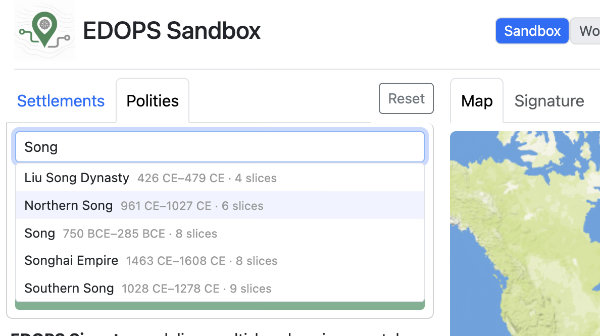
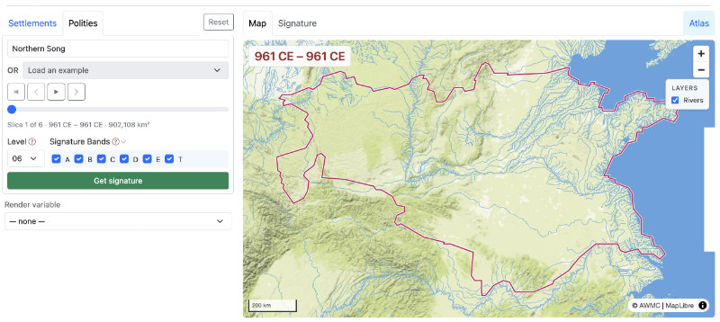
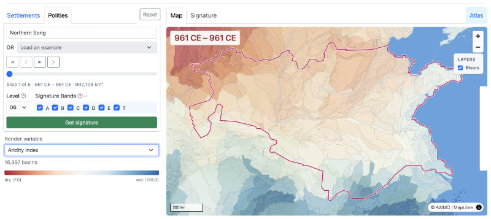
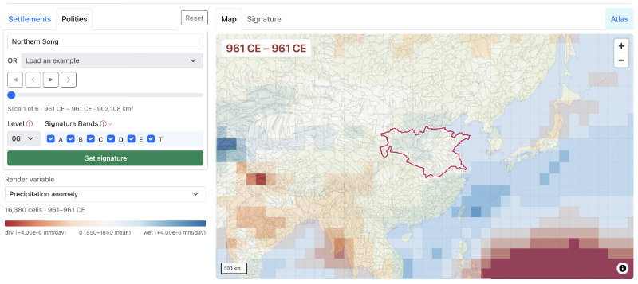
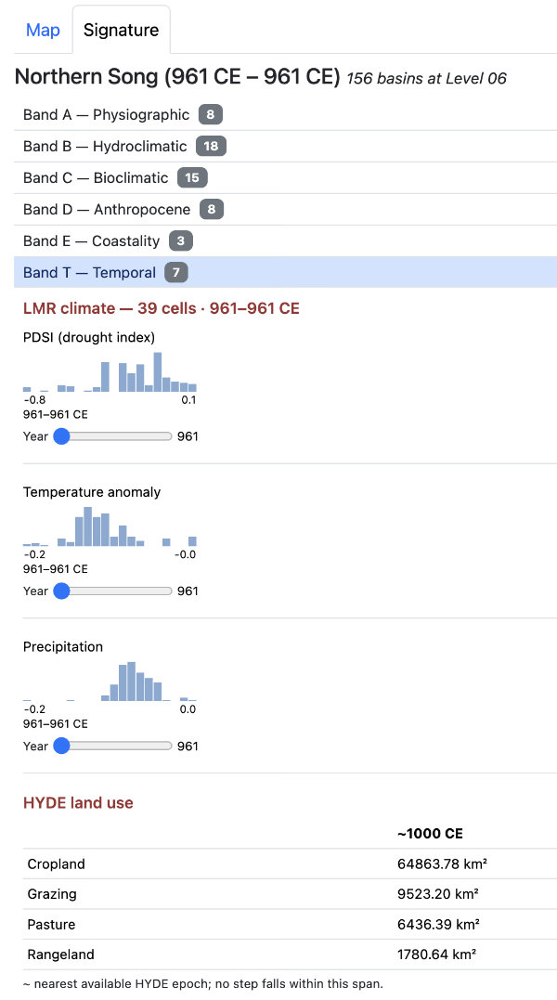
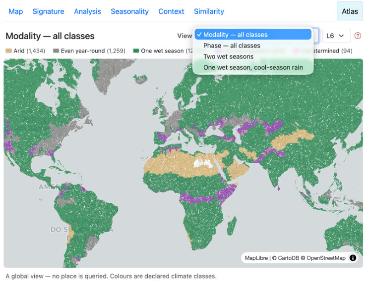
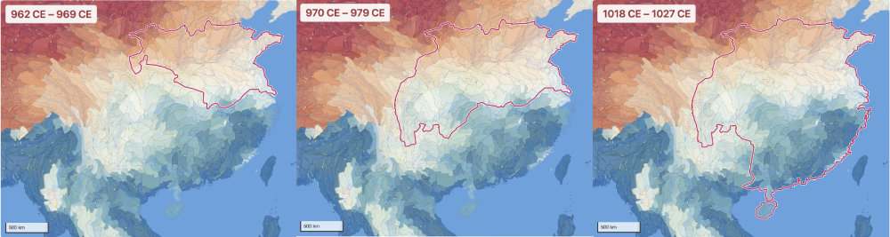
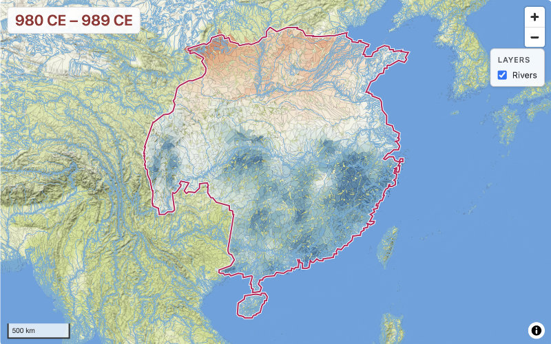
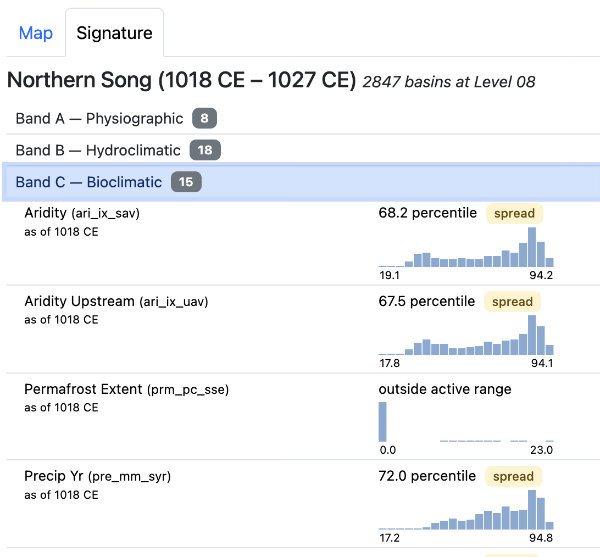

# Sandbox walkthrough: Polities

The Sandbox page generates and displays EDOPS signatures via two tab panels for named places (settlements or polities) or optionally a lat/lon coordinate location:

The **Polities** tab panel offers

- polity name lookup on a list of 1522 polity temporally scoped historical boundaries from the Cliopatria dataset
- a list of 6 example polities, with pre-filed timespans

The **Settlements** tab panel ([see separate walkthrough](walkthrough-settlement.md)) offers place name lookup of settlements and sites, specifying a Lat, Lon pair, and choice of five example settlements.

---
### Polities tab

The following steps walk through generating several signature shapes for the Northern Song Dynasty in 10-11c China, using the search of Cliopatria polity records. The examples dropdown provides a quick shortcut for making the initial parameter choices.

1. Type "Song" into the search box, and several possible choices are previewed. Select "Northern Song."

    

2. The six avaiable time slice records for Northern Song are queued, and the boundaries of the first - 961 CE - are displayed on the map. A time slider, with Forward, Play, and Reverse controls is now available. The Level and Signature bands controls are set to the defaults for polities: L06 and all bands. A "Render variable" dropdown menu offers ten variables to display on the map. The [Get&nbsp;signature] button is now active. 

    

3. Choose "Aridity Index" from the variables dropdown to paint the basins globally for those values. Note that Aridity Index is one of the modern BasinATLAS variables, so values do not correspond to 10c conditions.

    

4. Choose "Precipitation anomaly" - a temporally scoped variable from the LMR dataset - and zoom out two steps to view the global anomalies during that period and how they compare to the Northern Song, where precipitation was somewhat greater than modeled norms for climatology for 850–1850. (cf. [Data sources](../data-sources.md)).

    

5. Click the [Get signature] button, and the results are displayed on the Signature tab panel, with the Band T - Temporal group open. Note that the results for climate are not summarized to means for the polity, but reported as distribution across the 39 LMR cell intersecting 156 Level 06 basins for the Northern Song in 961 CE; also that HYDE land use values are summed. A link to a ["How to read this"](reading-a-signature.md) guide is at the top of the Signature panel.

    

6. The "Atlas" tab displays a global map for exploring variation in climate modularity (temp/precip correspondences, # of wet seasons), and is not tied to the chosen polity at all.

    

7. Return to the Map panel and load the "Aridity Index" variable again. Then advance the time slices with the Forward button [>]. Note there was little change in extent at the first step but considerable growth southward. Over a period of 27 years Northern Song territory grew to include significantly wetter areas.

    

8. Change the basin scale Level from 06 to 08. A much more highly articulated view of aridity is rendered to the map.

    

9. Click [Get signature] again, and see the data returned for the largest extent (1018-1027 CE) covers 2847 basins, and for LMR climate 93 cells. At Level 06 it was 376 basins and the same 93 LMR cells. The increase in basins is reflected in the density and distributional patterns of histograms across the bands.

    

