# Sandbox walkthrough: Settlements

The Sandbox page generates and displays EDOPS signatures via two tab panels for named places (settlements or polities) or optionally a lat/lon coordinate location:

The **Settlements** tab panel offers

- place name lookup of settlements and sites on World Historical Gazetteer (WHG)
- specifying a Lat, Lon pair
- choosing from a list of 5 example settlements

The **Polities** tab panel ([see separate walkthrough](walkthrough-polity.md)) offers

- polity name lookup on a list of 1522 polity temporally scoped historical boundaries from the Cliopatria dataset
- a list of 6 example polities, with pre-filed timespans

---
### Settlements tab

The following steps walk through generating several signature shapes for Tbilisi, Georgia using the WHG lookup path. Using the examples dropdown provides a quick shortcut for the initial parameter choices.

1. First zoom the map in to the Caucasus; this constrains the WHG search to that region and narrows the candidate list to the most likely matches. 

    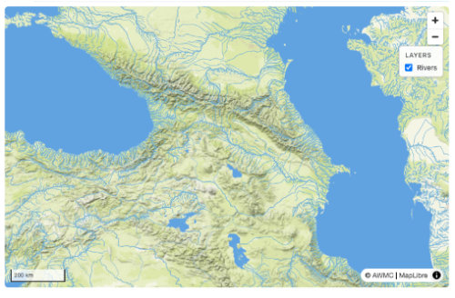

2. Enter "Tbilisi" and click the [Resolve] button. A single candidate record is offered, so click it. The map now shows the Level 06 basin containing Tbilisi.

    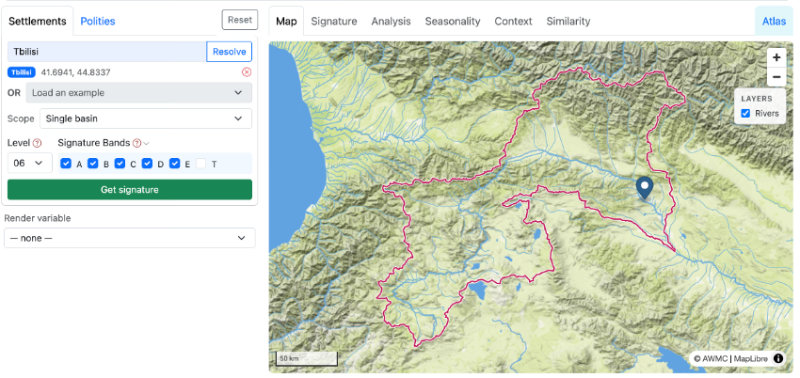

3. Choose the Level and Bands you want for the initial signature. Help icons explain the choices. Leave Level at "06" and click the checkbox "T" - we want a signature for the period 1400 - 1450 CE, so enter those years in the from/to boxes.

    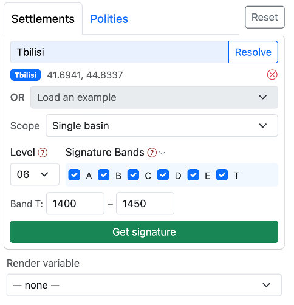

4. Before clicking [Get signature], notice we can render each of several variables to the map. Try any or all of them; this is Aridity Index.

    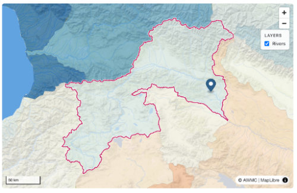

5. Our parameters are now set: place, level, bands, and timespan, so we can click [Get signature] and the data will load into the next five tab panels. We see "Signature" first, with all variables grouped in Band accordions, and Band T is open. Notice the "How to read this" link on the top right, which opens the site Documentation to a "[Reading a signature](reading-a-signature.md)" page.

    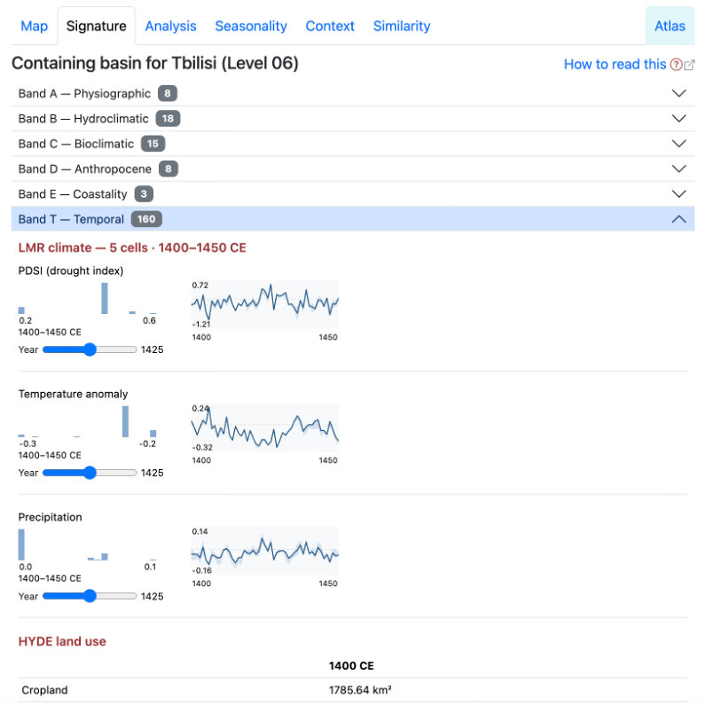

6. The other tabs have a variety of views on the data; briefly:
    - **Analysis** shows some raw and auto-generated derived stats focusing on the stream topology

        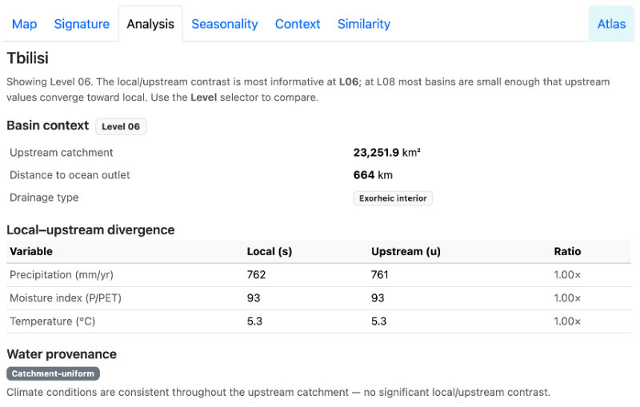

    - **Seasonality** illustrates the monthly variation at that basin for precipitation and temperature

        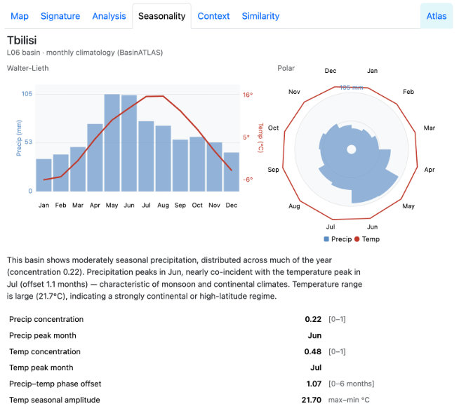

    - **Context** maps the values for selected variables in surrounding basins, within a selectable distance buffer

        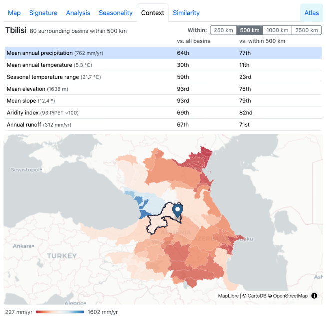

    - **Similarity** finds basins most similar to the selected basin globally, with respect to variables in one of four "lenses": Precipitation, Temperature, Climate (precip + temp), and Terrain. Dropdown controls per lens let you adjust the thresholds used in gauging similarity.

        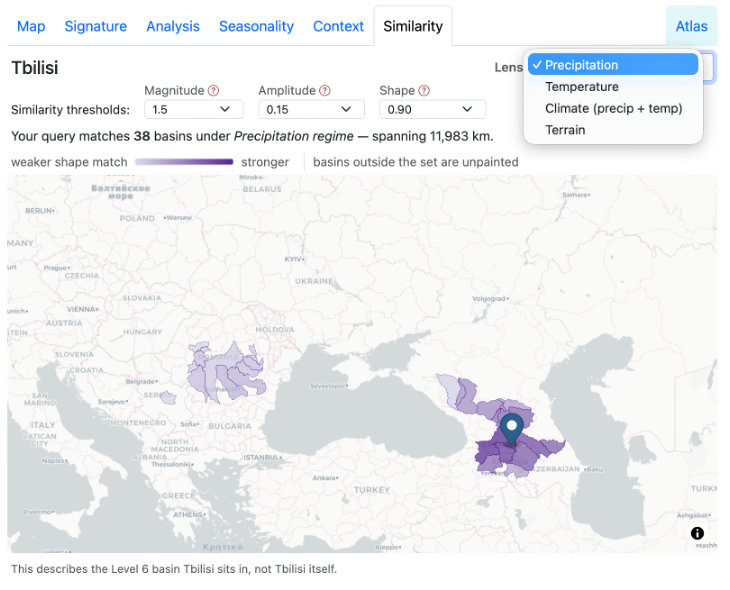

    - **Atlas** is apart from the others because it is not basin-specific. It is an experimental viewer for precipitation/temperature modality. Most regions have warm/wet, cool/dry patterns, but many don't. Also some areas have two wet periods per year while most have one. The Atlas panel allows exploration of these differences globally.

        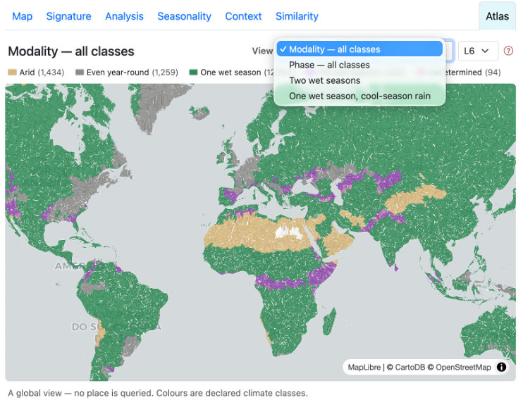

7. Go back to the map tab, and switch Scope from Single basin to Basin ring. The map now renders boundaries for the basins immediately surrounding the Tbilisi basin. The other tab panels still hold data for the core basin, but you can now pull signatures for any of the ring basins, by selecting one on the map or the small compass rose glyph on the left

    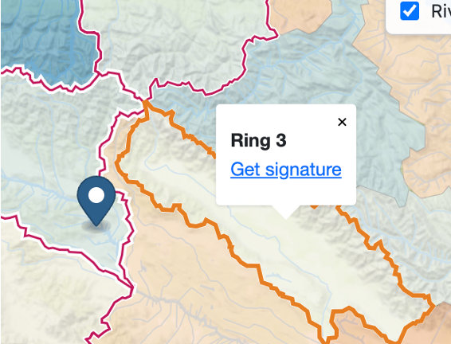

8. Click the center basin again, then change the Level from 06 to 08. The map now renders those much smaller basins. If you now click [Get signature] again, the data in the panels to the right will reflect that new Level 08 signature.

    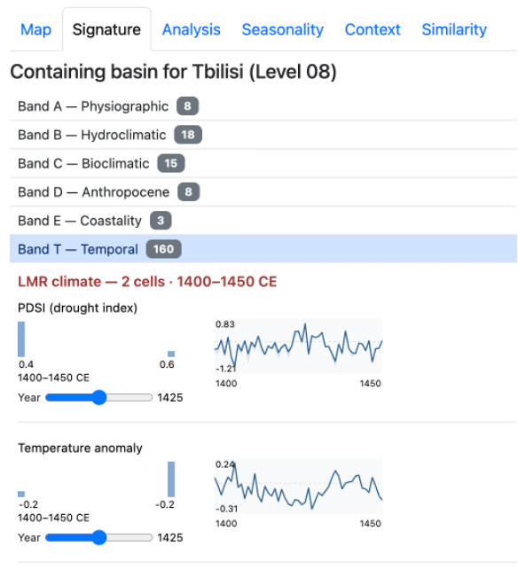

To clear all results and start over, click the [Reset] button. 

